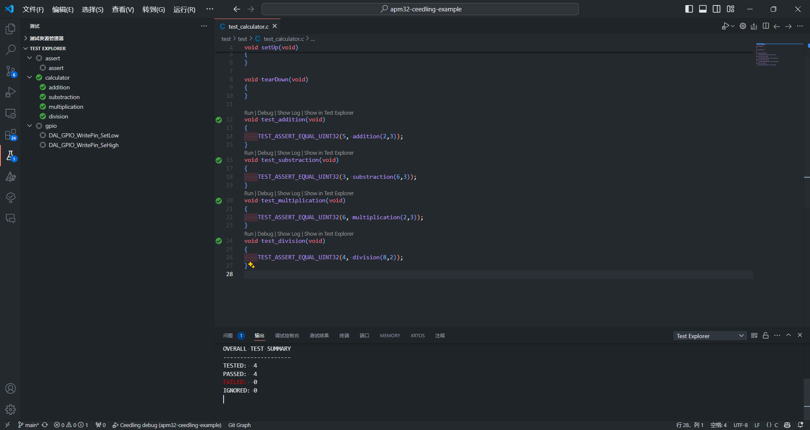

# apm32-ceedling-example

[](https://github.com/MorroGeek/apm32-ceedling-example/releases/latest)

The apm32-ceedling-example project is an example project that demonstrates how to use Ceedling unit testing with the APM32 Device Abstraction Layer and the APM32 CMSIS driver. The project is built using the CMake build system and CMake Presets. 

The project contains a Ceedling test project that tests the APM32 application project. And can use the Ceedling cmock mocking to mock the APM32 DAL functions. The project also contains a Ceedling gcov code coverage that generates code coverage reports.




## Features

- unity unit testing
- cmock mocking
- gcov code coverage
- gcovr code coverage report
- CMake build system
- CMake Presets
- CMake custom command
- APM32 Device Abstraction Layer
- APM32 CMSIS driver
- APM32 SVD files

## Directory Structure

| Directory                                             | Content                                                                                     |
| :---------------------------------------------------- | :------------------------------------------------------------------------------------------ |
| [apm32-ceedling-example/.vscode](./.vscode)           | Contains Ceedling configuration files and Ceedling Test Explorer launch configuration files |
| [apm32-ceedling-example/application](./application)   | Contains APM32 application project files                                                    |
| [apm32-ceedling-example/cmake](./cmake)               | Contains CMake scripts for building the project                                             |
| [apm32-ceedling-example/driver](./driver)             | Contains APM32 DAL driver and CMSIS driver                                                  |
| [apm32-ceedling-example/svd](./svd)                   | Contains APM32 SVD files                                                                    |
| [apm32-ceedling-example/test](./test)                 | Contains Ceedling test project files                                                        |

## Supported Platforms

| Platform      | Device                                                          |
| :------------ | :-------------------------------------------------------------- |
| APM32F4       | APM32F405xx, APM32F407xx, APM32F417xx, APM32F411xx, APM32F465xx |

## Dependencies

- [Ruby](https://www.ruby-lang.org/en/)
- [Ceedling](https://github.com/ThrowTheSwitch/Ceedling)
- [CMake](https://cmake.org/)
- [GNU Arm Embedded Toolchain](https://developer.arm.com/tools-and-software/open-source-software/developer-tools/gnu-toolchain/gnu-rm)
- [gcovr](https://gcovr.com/en/stable/)

## Recommended Tools

- [J-Link Software and Documentation Pack](https://www.segger.com/downloads/jlink/)
- [Visual Studio Code](https://code.visualstudio.com/)
- [Ceedling Test Explorer](https://marketplace.visualstudio.com/items?itemName=numaru.vscode-ceedling-test-adapter)
- [Cortex-Debug](https://marketplace.visualstudio.com/items?itemName=marus25.cortex-debug)
- [CMake Tools](https://marketplace.visualstudio.com/items?itemName=ms-vscode.cmake-tools)

## Getting Started

Ensure that all dependencies are installed on your system and that environment variables are properly set up. And then follow the steps below to build the project.
You can using the following commands to build the project. Also, you can use the CMake Tools extension in Visual Studio Code to build the project.

### Clone the repository

```bash
git clone
```

### Initialize CMake project

Using CMake Presets to initialize the project. The following command will create a build directory and generate the build system files. The preset option is set to Debug. You can change the preset option to Release or any other preset defined in the CMakePresets.json file.

```bash
cmake -S . -B build/Debug --preset Debug
```

### Make the project

You can make the project again using the following CMake custom target.

```bash
cmake --build build/Debug --target project-debug-make
```

### Build the project

You can build the project using the following CMake custom target.

```bash
cmake --build build/Debug --target project-debug-build
```

### Debug the project

Using the JLink launch configuration in the .vscode directory to debug the project. Open the project in Visual Studio Code and press F5 to start debugging.

```json
{
    "version": "0.2.0",
    "configurations": [
        {
            "name": "Cortex Debug with J-Link",
            "cwd": "${workspaceRoot}",
            "executable": "./build/Debug/test-firmware.elf", // Change the executable path
            "request": "launch",
            "type": "cortex-debug",
            "servertype": "jlink",
            "device": "APM32F405RG",
            "interface": "swd",
            "svdFile": "./svd/APM32F40x.svd",
        },
    ]
}
```

### Test the project

You can test the project using the following CMake custom target.

```bash
cmake --build build/Debug --target test-all
```

### Generate code coverage

You can generate code coverage using the following CMake custom target.

```bash
cmake --build build/Debug --target test-coverage-report-html
```

### Clean the test project

You can clean the test project using the following CMake custom target.

```bash
cmake --build build/Debug --target test-clean
```
